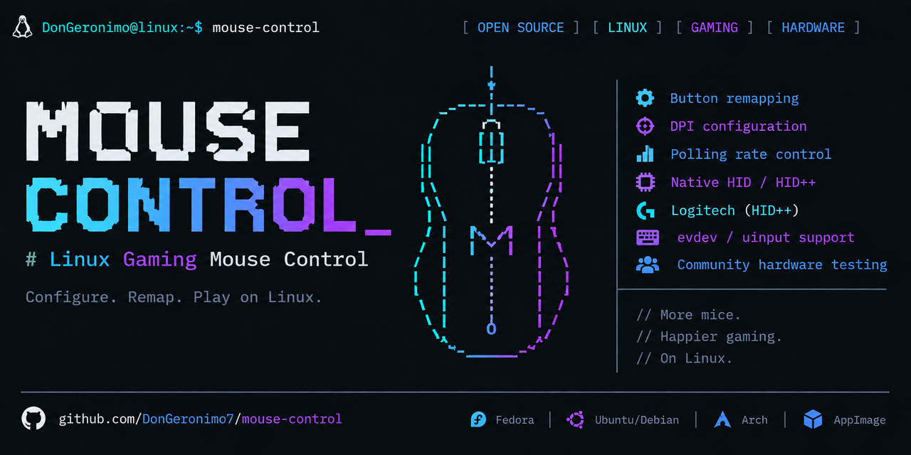

# Mouse Control



Open-source Linux gaming mouse remapping and hardware discovery: map mouse
buttons to keyboard keys, configure proven DPI and polling rates, and safely
help expand support for new hardware.

[](https://github.com/DonGeronimo7/mouse-control/releases/tag/v0.9.4)
[](https://github.com/DonGeronimo7/mouse-control/actions/workflows/ci.yml)
[](pyproject.toml)
[](LICENSE)
[](https://github.com/DonGeronimo7/mouse-control)

Mouse Control is a terminal-native Linux gaming mouse utility for people whose
vendor software does not work on Linux. Ordinary button remapping uses
`evdev`/`uinput`, so it remains useful on Wayland and does not depend on
vendor-specific hardware control.

Where a validated backend exists, Mouse Control also exposes DPI and
polling/report-rate control. Native Logitech HID++ support is built in,
exact-model native Razer support is built in, and Automatic Discovery can safely gather evidence for
unknown hardware without guessing write commands.

## Current release: v0.9.4

The current release is [v0.9.4](https://github.com/DonGeronimo7/mouse-control/releases/tag/v0.9.4).

Mouse Control v0.9.4 promotes the validated Automatic Hardware Discovery
checkpoint: learned HID state is persisted with descriptor-backed semantic
identity, rebound conservatively after reconnect, and exposed through the
normal setup and runtime paths without guessing unknown-device writes.

Run:

```bash
mouse-control setup
```

The setup wizard is now a full-screen keyboard-driven TUI with revisitable
sections for:

- Device
- Hardware / Discovery
- Buttons
- DPI
- Polling
- Service
- Review / Save

Running `mouse-control` without a command from an interactive terminal opens
this same TUI immediately. Redirected or otherwise noninteractive setup is
rejected with a clear error before curses starts; there is no legacy prompt
wizard fallback.

If the selected mouse already has proven hardware support, setup simply shows
those capabilities and lets you configure them. If the mouse is unknown,
setup can offer **Guided Discovery** directly. Users do not need to know HID,
`hidraw`, protocol teachers, feature reports, write scopes, or discovery CLI
commands.

## Safe Guided Discovery

Guided Discovery begins read-only. It first performs passive physical-device,
interface, descriptor, and known-adapter discovery. If DPI behavior is still
unknown and the existing learner can safely observe it, setup can guide five
samples:

1. Quiet/idle control.
2. Normal movement and one left click without the DPI/profile button.
3. DPI-button sample.
4. DPI-button sample.
5. DPI-button sample.

The workflow reuses the same underlying learning code as
`mouse-control-discover`; setup does not maintain a second protocol-learning
implementation.

Observation does **not** grant hardware write authority. Descriptor similarity,
VID/PID similarity, protocol resemblance, observed report bytes, and evidence
from another model are not enough. Writable DPI or polling control is exposed
only when the existing exact-model PROVEN requirements are satisfied, including
reversible proof, readback, physical verification where required, rollback,
unambiguous identity, and safe control ownership.

There is no speculative generic polling writer. If a capability cannot yet be
proved safely, setup says that it is **not yet learned** and ordinary button
remapping remains available.

## DPI configuration

The DPI editor separates **live testing** from **accepting** a stage.
Choose a DPI stage, enter a candidate value, and test it on the real mouse.
Moving the mouse at that temporary value does not silently change the staged
configuration.

The editor provides:

- **Test live** — temporarily apply and verify the candidate DPI.
- **Accept value** — explicitly save the verified candidate into that setup stage.
- **Set to current** — read the mouse's current verified DPI, including a value
  selected using the physical DPI button, and use it as the candidate.
- **Cancel / Back** — leave the staged configuration unchanged and restore the
  hardware DPI that was active when the editor opened when restoration is
  possible.

Configured defaults remain 800, 1500, 2000, 2500, and 3000 DPI. Hardware values
are never guessed; live editing is offered only when a writable DPI capability
is already proven for the selected mouse.

## What Mouse Control does

- Remaps gaming-mouse buttons to mouse actions, keyboard keys, or keyboard chords.
- Passes through or disables buttons.
- Supports a configurable `dpi-cycle` action.
- Configures DPI only through validated writable capabilities.
- Configures polling/report rate only through validated writable capabilities.
- Uses native Logitech HID++ discovery for supported capabilities.
- Uses independently PROVEN exact-model learned operations where available.
- Uses native, readback-verified control for explicitly modeled Razer hardware.
- Falls back to read-only generic HID diagnostics plus evdev/uinput remapping.
- Preserves DPI notifications, reconnect recovery, late receiver insertion,
  battery/tray behavior, and user-service controls from the v0.9.0 runtime.

Mouse Control deliberately excludes RGB/lighting control, multiple profiles,
and unrelated hardware features.

## Get Mouse Control

Release page: [Mouse Control v0.9.4](https://github.com/DonGeronimo7/mouse-control/releases/tag/v0.9.4)

- **Fedora / Nobara / RPM:** [mouse-control-0.9.4-1.fc44.noarch.rpm](https://github.com/DonGeronimo7/mouse-control/releases/download/v0.9.4/mouse-control-0.9.4-1.fc44.noarch.rpm)
- **Debian / Ubuntu / Mint:** [mouse-control_0.9.4-1_all.deb](https://github.com/DonGeronimo7/mouse-control/releases/download/v0.9.4/mouse-control_0.9.4-1_all.deb)
- **Other distributions:** [Mouse-Control-0.9.4-x86_64.AppImage](https://github.com/DonGeronimo7/mouse-control/releases/download/v0.9.4/Mouse-Control-0.9.4-x86_64.AppImage)
- **Arch Linux:** included [`PKGBUILD`](PKGBUILD)
- **Python wheel:** [mouse_control-0.9.4-py3-none-any.whl](https://github.com/DonGeronimo7/mouse-control/releases/download/v0.9.4/mouse_control-0.9.4-py3-none-any.whl)
- **Source:** [mouse_control-0.9.4.tar.gz](https://github.com/DonGeronimo7/mouse-control/releases/download/v0.9.4/mouse_control-0.9.4.tar.gz)

### Fedora, Nobara, and other RPM systems

```bash
sudo dnf install ./mouse-control-0.9.4-1.fc44.noarch.rpm
```

The RPM installs the Python/runtime dependencies, desktop launcher, icons, and
Mouse Control udev rules. It does not silently enable the background service.

### Debian, Ubuntu, Mint, and other DEB systems

```bash
sudo apt install ./mouse-control_0.9.4-1_all.deb
```

### AppImage

```bash
chmod +x Mouse-Control-0.9.4-x86_64.AppImage
./Mouse-Control-0.9.4-x86_64.AppImage setup
```

The AppImage bundles user-space application components but does not replace host
systemd, udev, kernel input support, or optional vendor drivers. Native packages
remain preferable when you want packaged host integration.

### Source

```bash
git clone https://github.com/DonGeronimo7/mouse-control.git
cd mouse-control
python3 -m venv .venv
source .venv/bin/activate
pip install -e .
```

## Updating

```bash
mouse-control update
```

Use `mouse-control update --check` for a non-modifying check and
`mouse-control update --yes` for a non-interactive update. v0.9.4 retains
visible interactive package-manager confirmation input instead of waiting for
an unseen prompt.

Repository packages may intentionally lag the newest GitHub release. Mouse
Control detects its documented installation methods and delegates changes to the
installation owner rather than manually overwriting package-managed files.

## Quick start

Install Mouse Control, then run setup as your normal logged-in desktop user:

```bash
mouse-control setup
```

You will see a full-screen setup screen. Use the arrow keys to move, Left/Right
to switch sections, Enter to select or edit, and `?` whenever you want help.
Nothing is saved until you choose **Review / Save**.

The usual path is simple:

1. Choose your mouse in **Device**.
2. Open **Buttons** and press each extra button you want to change.
3. Choose what it should do: keep its normal action, act like another mouse
   button, send a keyboard key or shortcut, disable it, or cycle configured DPI
   stages.
4. In **DPI** and **Polling**, choose settings when Mouse Control has already
   proved that it can safely control those features on this mouse.
5. Choose whether to start Mouse Control automatically when you sign in, then
   review and save.

Your button mappings work independently of DPI and polling support. An unknown
mouse can therefore be useful immediately.

After saving, install the user service once if you want Mouse Control to run
automatically after you sign in:

```bash
mouse-control install-service
mouse-control start
mouse-control status
```

Service commands:

```bash
mouse-control start
mouse-control stop
mouse-control restart
mouse-control status
```

`mouse-control run` remains the explicit foreground/debug command.

## Buttons and configuration

Setup stores your choices here:

```text
~/.config/mouse-control/config.toml
```

You normally do not need to edit this file. If you do, the available actions
are:

- `passthrough`
- `disable`
- `mouse:BTN_*`
- `key:KEY_*`
- `chord:KEY_*+KEY_*`
- `dpi-cycle`

When you capture a keyboard shortcut, Mouse Control temporarily keeps that
shortcut from also reaching your desktop. If Linux does not let it read the
keyboard, you can enter the key name manually instead.

Example:

```toml
[remap]
BTN_EXTRA = "chord:KEY_LEFTCTRL+KEY_LEFTSHIFT+KEY_S"
```

## Trying an unsupported mouse?

Start exactly the same way:

```bash
mouse-control setup
```

Select the mouse, configure its buttons, then visit **Hardware / Discovery**.
If Mouse Control does not yet know how to safely change its DPI or polling
rate, choose **Run Guided Discovery**. You can skip discovery at any time and
keep using normal button remapping.

Guided Discovery is a five-sample, read-only check. It asks you to:

1. Leave the mouse still for a quiet/control sample.
2. Move it normally and left-click once for a normal-use sample.
3. Keep it still and press the DPI button once.
4. Keep it still and press the DPI button once again.
5. Keep it still and press the DPI button one final time.

This lets Mouse Control tell ordinary mouse traffic apart from the action made
by the DPI button. It only watches what the mouse already sends; it does not
send a command to an unknown mouse.

An identified DPI button is useful progress, but it is **not** proof that
Mouse Control can safely set DPI. A button shows that the mouse can change DPI;
a safe write command is the separate, device-specific instruction needed to
ask it to do so. Mouse Control exposes writable DPI or polling controls only
after that exact model and operation have been independently proven safe. It
never guesses a command from a similar mouse, a product ID, or the bytes it
observed during discovery.

If discovery finds only the button behavior, setup will say **DPI write command
not yet proven**. That is an honest result, not a failed setup: your mappings
can still be saved and used normally.

For developer diagnostics and community hardware acceptance, the lower-level
commands remain available. For example:

```bash
mouse-control doctor --report
mouse-control support
sudo mouse-control-discover --full-access --generic-only --learn-dpi-button --verbose
```

These advanced paths are useful for debugging and reports; ordinary users do
not need them to reach the guided setup workflow.

Hardware reports can be attached to the repository's
[hardware compatibility issue template](https://github.com/DonGeronimo7/mouse-control/issues/new?template=hardware-compatibility.yml).
Review reports before posting and remove anything you do not want to share.

## How hardware support works

Mouse Control starts safe and becomes more capable only when it has real
evidence for your exact mouse:

1. It recognizes the physical mouse and its Linux connections.
2. It checks for a built-in, validated implementation such as Logitech HID++
   or exact-model native Razer RPC.
3. If a feature is already proven for that exact model, setup offers it.
4. Otherwise, it stays read-only, can offer Guided Discovery, and leaves
   ordinary remapping fully available.

The technical name for the mouse's low-level conversation is a “protocol.”
Mouse Control does not borrow a protocol command from another model just
because the brand or connection looks similar.

## Hardware support

The detailed evidence-based record is in
[`docs/COMPATIBILITY.md`](docs/COMPATIBILITY.md).

| Hardware / backend | Status | Notes |
| --- | --- | --- |
| Logitech G305 | Fully tested reference | Button remapping, DPI, DPI notifications, and 1000/500/250/125 Hz polling have been tested on real hardware. |
| Other Logitech HID++ mice | Promising, model-by-model | Mouse Control discovers the needed details live, but G305 results are not assumed to apply to another model. |
| Modeled Razer Viper V2/V3 variants | Native exact-model support | DPI, polling, firmware and applicable battery state use native RPC with readback; broader real-hardware testing is still welcome. |
| Any other mouse | Safe fallback | Button remapping and read-only diagnostics can work even when DPI and polling controls are not yet proven. |

## Device permissions

The Fedora RPM installs:

```text
/usr/lib/udev/rules.d/71-mouse-control-uaccess.rules
```

The packaged rules give your signed-in desktop session the access Mouse Control
needs for the selected mouse and for creating the remapped input device. For a
source install, install the supplied rule and reload udev:

```bash
sudo install -Dm644 src/mouse_control/udev/71-mouse-control-uaccess.rules \
  /etc/udev/rules.d/71-mouse-control-uaccess.rules
sudo udevadm control --reload-rules
```

Then reconnect the device or log out/in and run:

```bash
mouse-control check-permissions
mouse-control setup
```

Do not run normal setup or the background service as root. Guided Discovery is
safe by design, but the advanced diagnostic command shown above may request
`sudo` so it can read every relevant hardware interface.

## Logitech G305 / HID++ reference

The Logitech G305 is the reference mouse tested on real hardware for Mouse
Control's built-in Logitech support and its safety model. Its results are not a
promise for every Logitech mouse.

Mouse Control discovers the required device details live and keeps the DPI
setting path separate from the notification sent when the physical DPI button
is pressed. This prevents one kind of hardware message from being mistaken for
another.

## Native Razer protocol support

Mouse Control does not require the OpenRazer daemon, kernel module, D-Bus API,
or Python client. OpenRazer remains protocol provenance only. Exact modeled
devices use Mouse Control's native 90-byte RPC implementation; unknown Razer
devices remain read-only and keep normal remapping available.

## What Mouse Control intentionally does not do

Mouse Control focuses on reliable button remapping plus DPI and polling where
those controls are proven safe. It does not currently try to manage RGB
lighting, lighting effects, hardware profiles, or every vendor-specific mouse
feature.

That narrow focus is deliberate: it lets an unsupported mouse remain useful
without risking a guessed hardware command.

## Safety and compatibility contract

The complete v0.8.2 stability contract, plus the v0.9.0 runtime behavior and
v0.9.1 TUI, remains the compatibility baseline for v0.9.4 and future releases.
In particular, development must not regress:

- ordinary evdev/uinput remapping;
- keyboard keys and held chords;
- configured `dpi-cycle` behavior;
- direct DPI notifications;
- native Logitech HID++;
- learned DPI and learned polling;
- learned-action triggering;
- reconnect and late receiver insertion;
- battery/tray behavior;
- setup rollback and configuration preservation;
- user-service behavior;
- updater behavior; or
- release packaging.

## Development and validation

```bash
PYTHONPATH=src pytest -q
python -m compileall -q src tests
```

The v0.9.4 release checkpoint passes 660 automated tests with one known GLib
deprecation warning. Compile and whitespace checks, Python sdist/wheel, Fedora
RPM (including `%check` and packaged CLI smoke), Debian package, and AppImage
build/smoke validation pass. Final v0.9.4 G305 physical acceptance and
published-asset validation remain explicit release gates.

See [`CONTRIBUTING.md`](CONTRIBUTING.md) for contributions and hardware reports.
See [`RELEASE_NOTES.md`](RELEASE_NOTES.md) for release-specific details.

## License

Mouse Control is licensed under the GNU General Public License, version 3 or
later. See [`LICENSE`](LICENSE).
