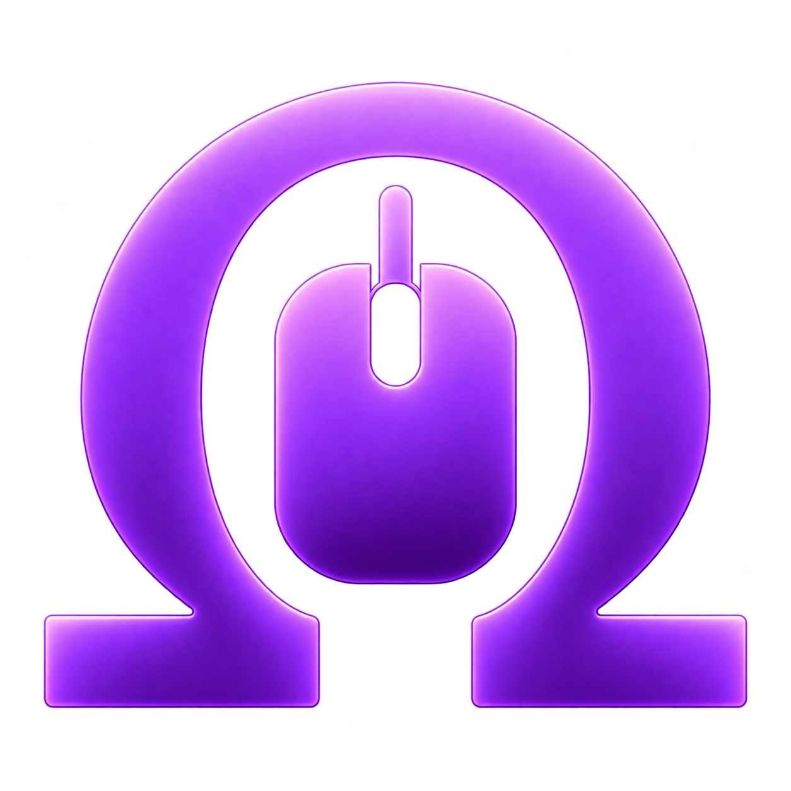

<p align="center">
  
</p>

<h1 align="center">OMUS</h1>
<p align="center"><strong>One Mouse Universal System</strong></p>
<p align="center"><strong>Every mouse. One system.</strong></p>

<p align="center">
  Native Linux control for gaming mice&mdash;remapping, DPI, polling, lighting,<br>
  and automatic hardware discovery.
</p>

<p align="center">
  <a href="#install">Install</a> &middot;
  <a href="#hardware-support">Hardware Support</a> &middot;
  <a href="#automatic-discovery">Automatic Discovery</a> &middot;
  <a href="#security--trust">Security</a> &middot;
  <a href="CONTRIBUTING.md">Contributing</a>
</p>

<p align="center">
  <a href="https://github.com/DonGeronimo7/OMUS/releases/tag/v1.0.2"></a>
  <a href="https://www.bestpractices.dev/projects/14722"></a>
  <a href="https://scorecard.dev/viewer/?uri=github.com/DonGeronimo7/OMUS"></a>
  <a href="https://github.com/DonGeronimo7/OMUS/actions/workflows/ci.yml"></a>
  <a href="https://github.com/DonGeronimo7/OMUS/actions/workflows/codeql.yml"></a>
  <a href="https://github.com/DonGeronimo7/OMUS/actions/workflows/virustotal-release.yml"></a>
</p>
<p align="center">
  <a href="LICENSE"></a>
  
  
</p>

OMUS was previously known as Mouse Control. The `mouse-control` command and
legacy configuration remain supported for existing users and scripts.

## What OMUS does

| Control | Discovery | Safety |
| --- | --- | --- |
| Button remapping | Unknown-device inspection | Read-only discovery first |
| Keys, shortcuts, and sequential macros | HID structure and relationships | Exact-device binding |
| DPI and polling where proven | Guided behavioral observation | Operation-specific proof |
| Per-device lighting where proven | Protocol recognition and learning | Readback where available |
| Notifications and reconnect recovery | Privacy-conscious support reports | Ambiguity means no write |
| TUI, service, and updater | Reusable, path-independent evidence | No telemetry |

Ordinary evdev/uinput remapping does not depend on optional hardware control.
An unavailable or unproven DPI, polling, or lighting path does not stop OMUS
from providing safe software remapping.

## Why OMUS

Traditional mouse tools primarily begin with a known device or protocol. OMUS
can also inspect unfamiliar hardware and gather evidence toward safe, reusable
support:

```text
Unknown mouse
     ↓
HID structure
     ↓
Behavioral observation
     ↓
Protocol inference
     ↓
Evidence + validation
     ↓
Safe control, only when independently proven
```

Recognition is not write authority. Product names, USB IDs, descriptor shapes,
and changing bytes can guide discovery, but OMUS refuses a hardware write when
the physical device, interface, protocol, or operation remains ambiguous.

## Install

The current release is [v1.0.2](https://github.com/DonGeronimo7/OMUS/releases/tag/v1.0.2).
Native packages are preferred because they install the desktop launcher, user
service integration, dependencies, and device-access rules.

### Fedora, Nobara, and other RPM systems

[Download the RPM](https://github.com/DonGeronimo7/OMUS/releases/download/v1.0.2/omus-1.0.2-1.fc44.noarch.rpm), then install it:

```bash
sudo dnf install ./omus-1.0.2-1.fc44.noarch.rpm
```

### Debian, Ubuntu, Mint, and other DEB systems

[Download the DEB](https://github.com/DonGeronimo7/OMUS/releases/download/v1.0.2/omus_1.0.2_all.deb), then install it:

```bash
sudo apt install ./omus_1.0.2_all.deb
```

### Other x86-64 Linux distributions

[Download the AppImage](https://github.com/DonGeronimo7/OMUS/releases/download/v1.0.2/OMUS-1.0.2-x86_64.AppImage), then run:

```bash
chmod +x OMUS-1.0.2-x86_64.AppImage
./OMUS-1.0.2-x86_64.AppImage setup
```

The AppImage bundles the user-space application but cannot replace the host's
systemd, udev, or kernel input support. An [Arch `PKGBUILD`](PKGBUILD),
[Python wheel](https://github.com/DonGeronimo7/OMUS/releases/download/v1.0.2/omus-1.0.2-py3-none-any.whl),
and [source archive](https://github.com/DonGeronimo7/OMUS/releases/download/v1.0.2/omus-1.0.2.tar.gz)
are also available.

Launch OMUS as your normal desktop user:

```bash
omus
```

Do not run normal setup or the background service as root.

## Quick start

1. Launch `omus`.
2. Choose a mouse under **Device**.
3. Configure supported hardware and button mappings.
4. Inspect **Review / Save** before writing the configuration.
5. Enable the user service when you want mappings restored at sign-in.

The full-screen TUI is the complete interactive application. `omus setup` and
`omus tui` open the same interface; the CLI remains available for scripts and
advanced diagnostics.

```bash
omus install-service
omus start
omus status
```

Configuration is stored at `~/.config/omus/config.toml`. On first use, OMUS
non-destructively copies a legacy `~/.config/mouse-control/` tree only when the
canonical OMUS location is absent.

## Hardware support

OMUS describes support per operation, not merely per model. See the
[hardware compatibility matrix](docs/COMPATIBILITY.md) for the evidence behind
validated claims.

- **Validated hardware** has physical evidence for the operations listed in
  the matrix. The Logitech G305 is the current validated reference device.
- **Native protocol families** have implemented adapters, but evidence from one
  exact model is not generalized to every related mouse.
- **Discoverable hardware** can use software remapping and the read-only
  learning pipeline even when hardware controls are unknown.
- **Unsupported or unproven writes** remain unavailable until the exact
  operation meets OMUS's proof and binding requirements.

OMUS includes an exact-model Razer RPC implementation and dynamically discovers
Logitech HID++ features. Availability still depends on the connected device's
reported capabilities and exact evidence; neither protocol name is a blanket
support claim.

## Test an unsupported mouse

### Your unsupported mouse is useful.

Unfamiliar hardware can reveal a protocol pattern or device behavior shared by
other mice. OEM and rebrand models, smaller gaming brands, older devices,
trackballs, and mice normally configured through Windows software are
especially valuable.

1. Install OMUS and connect the mouse.
2. Run `omus` and select the device.
3. Open **Hardware / Discovery** and choose **Run Guided Discovery** when
   offered.
4. Follow the requested actions; you can skip discovery and still save normal
   button mappings.
5. Generate a support report and submit a
   [hardware compatibility issue](https://github.com/DonGeronimo7/OMUS/issues/new?template=hardware-compatibility.yml).

```bash
omus support --guided
omus discover --output omus-discovery.json
```

Guided Discovery starts read-only. The structured report is allowlisted and
excludes usernames, serial numbers, device paths, and input history. The human-
readable report includes only selected-device and basic system information, not
an unrelated USB inventory. Always review files before sharing them.

## Security & trust

OMUS makes its controls inspectable instead of asking users to trust a broad
claim:

- [OpenSSF Best Practices](https://www.bestpractices.dev/projects/14722) and a
  continuously generated [OpenSSF Scorecard](https://scorecard.dev/viewer/?uri=github.com/DonGeronimo7/OMUS);
- CodeQL, dependency auditing, hash-locked dependencies, pinned GitHub Actions,
  and ClusterFuzzLite coverage for bounded parsers;
- point-in-time VirusTotal scanning of primary release artifacts;
- release SHA-256 verification, CycloneDX SBOMs, and GitHub/Sigstore SLSA
  provenance;
- local-only normal runtime with no telemetry, analytics, crash upload, or
  automatic hardware-report upload; and
- exact-device write boundaries: generic inspection is read-only and ambiguous
  matches are refused.

The updater contacts the official GitHub release endpoint only after an
explicit check or update action. It verifies direct-download artifacts against
the release checksum manifest and respects the installation's package manager.

Read [SECURITY.md](SECURITY.md) for vulnerability reporting and runtime trust
boundaries, and the [supply-chain security guide](docs/SECURITY_SUPPLY_CHAIN.md)
for release verification, SBOM, provenance, and dependency policy.

## Automatic Discovery

Automatic Discovery separates what OMUS has seen from what it may safely do:

| Evidence | Meaning |
| --- | --- |
| `OBSERVED` | Raw structure or behavior was captured. |
| `CORRELATED` | A repeatable relationship was found. |
| `VALIDATED` | Independent evidence confirmed the interpretation. |
| `PROVEN` | An exact operation met the requirements for its claimed authority. |

Physical calibration may prove that a DPI transition occurred; it does not
reveal how to write firmware state. A learned read-side source may report a
state without becoming a writer. Writable behavior requires an independently
proven implementation, an unambiguous physical binding, safe ownership, and
verification or readback where the protocol permits it.

For the identity model, learning stages, protocol repertoire, and promotion
rules, read the [Automatic Discovery architecture](docs/discovery-architecture.md).

## Everyday tools

The TUI provides normal configuration, service, update, and support-report
workflows. Useful command-line entry points include:

```bash
omus update --check
omus check-permissions
omus cpi --distance-mm 50.8
```

The vendor-neutral CPI tool reads Linux motion events without sending vendor
protocol commands. Stop the OMUS service first if it owns the selected event
device. Source installs that lack device access can use the checked-in udev rule;
native packages install it automatically.

## Developers & researchers

```bash
git clone https://github.com/DonGeronimo7/OMUS.git
cd OMUS
python3 -m venv .venv
source .venv/bin/activate
pip install -e .
PYTHONPATH=src pytest -q
```

Start with the [discovery architecture](docs/discovery-architecture.md),
[compatibility matrix](docs/COMPATIBILITY.md), and
[code health audit](docs/CODE_HEALTH_AUDIT.md). Release history lives in
[RELEASE_NOTES.md](RELEASE_NOTES.md) and [CHANGELOG.md](CHANGELOG.md).

## Contributing

Hardware reports, documentation, protocol evidence, tests, and focused code
changes are welcome. Read [CONTRIBUTING.md](CONTRIBUTING.md) before submitting
an issue or pull request, especially when work could affect hardware writes.

## Credits & provenance

OMUS builds on public Linux input and mouse-protocol research while keeping
cited knowledge distinct from imported code and independently demonstrated
behavior. See [CREDITS.md](CREDITS.md) for projects, sources, and attribution.

## License

OMUS is licensed under the [GNU General Public License v3.0 or later](LICENSE).
